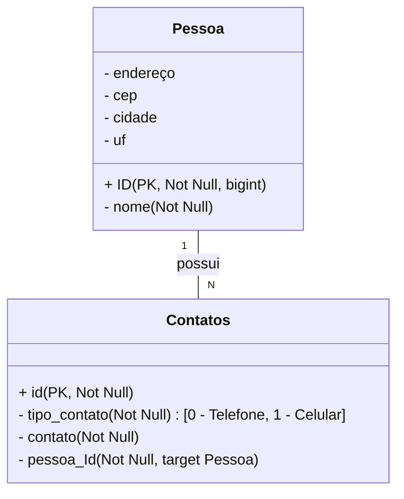

# Avaliação Java / Spring: API Rest para Controle de Contatos

O desafio consiste em criar uma aplicação API Rest para gerenciar um sistema de
cadastro de Pessoas e seus respectivos Contatos, onde cada Pessoa pode ter vários Contatos. O
principal objetivo é permitir que operações CRUD (Criar, Ler, Atualizar, Deletar) sejam realizadas
na estrutura de Pessoa e Contatos.

## Demonstração



## Tecnologias Utilizadas

- SpringBoot (MySQL Driver, SpringWeb, SpringDataJpa);
- Java JDK 17;
- Maven 3.9.5;
- MySQL 8;
- MYSQL workbench;
- Swagger;

## Instalação

1. Clone este repositório:
```
git clone https://github.com/silvamaciel/ProjetoJava-Minsait
```

2. Compile o projeto usando o Maven:
```
mvn clean install
```

Execute a aplicação Spring Boot:
```
mvn spring-boot:run
```

## Link para acessar documentação swagger:
```
http://localhost:8080/swagger-ui/index.html
```
## EndPoints

### - > ContatoController
```
 # POST /api/contatos/pessoas/{id}/contatos -> Adicionar um novo Contato a uma Pessoa:
```
```
 # GET /api/contatos/{id} - > Obter um Contato por ID 
```
```
 # GET /api/contatos/pessoas/{idPessoa}/contatos -> Listar todos os Contatos de uma Pessoa
```
```
#  PUT /api/contatos/{id} - > Atualizar um Contato existente por ID
```
```
# DELETE /api/contatos/{id} -> Remover um Contato por ID
```

### -> PessoaController
```
#  POST /api/pessoas - > Criar uma nova Pessoa
```
```
# GET /api/pessoas/{id} - >  Obter uma Pessoa por ID
```
```
# GET /api/pessoas - > Listar todas as Pessoas
```
```
# PUT /api/pessoas/{id} -> Atualizar uma Pessoa existente por ID
```
```
# DELETE /api/pessoas/{id} -> Remover uma Pessoa por ID
```
```
# GET /api/pessoas/maladireta/{id} -> Obter uma Pessoa para mala direta por ID
```

## Autor
Maciel Silva <br> [](https://www.linkedin.com/in/silvamaciel/)

## Agradecimentos
Agradecimentos ao Professor Eduardo Henrique pela excelência na didática e condução do treinamento. [https://www.linkedin.com/in/eduardohmferreira/]
